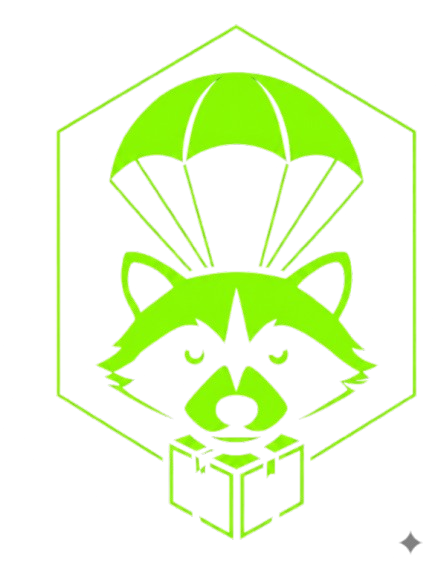

  

<h1 align="center">RaccDrop</h1>

  <strong>Your Payload. Our Drop.</strong> 
  A self-contained HTML smuggling payload generator. Zero dependencies. Pure client-side.

  
  
  
  

---

## What is RaccDrop?

RaccDrop generates **self-contained HTML files** that embed arbitrary files using various encoding and encryption techniques. When the generated HTML is opened in a browser, it automatically decodes the payload and triggers a download — no server required.

This is a technique known as [HTML Smuggling](https://attack.mitre.org/techniques/T1027/006/), commonly used in red team engagements and security research to deliver payloads through web-based channels that bypass network-level inspection.

## Features

| Method | Description |
|--------|-------------|
| **CSS** | Hides Base64 payload in a hidden `
` data attribute |
| **XOR** | XOR cipher with random key, output Base64-encoded |
| **AES** | AES-GCM encryption via Web Crypto API (256-bit key, 12-byte IV) |
| **RC4** | RC4 stream cipher with random key |
| **Base64** | Simple Base64 encoding |
| **Hex** | Hex-encoded string |
| **Reverse** | Reversed string |
| **CharCode** | JSON array of character codes |
| **Decimal** | Decimal dot-separated char codes |
| **Custom B64** | Custom shuffled Base64 alphabet |
| **SVG** | Payload hidden in an SVG `data-` attribute |
| **PNG carrier** | Raw file bytes packed into the RGB channels of an inline PNG, read back at runtime via `canvas.getImageData()` || **Multi-layer** | Chain any combination of the above methods |

`CSS`, `SVG` and `PNG carrier` are containers rather than encodings — they park the
payload in the DOM instead of a JS string literal, and are not chainable.

#### A note on the PNG carrier

It does **not** save space. Measured on 100 KB of incompressible input, against
every other method:

| Method | Output | Factor |
|---|---:|---:|
| `reverse` | 135,366 B | 1.35x |
| `base64`, `css`, `svg`, `xor`, `aes`, `rc4`, `customb64` | ~180,000 B | 1.80x |
| **`canvas`** | **188,496 B** | **1.88x** |
| `hex` | 268,809 B | 2.69x |
| `charcode`, `decimal` | 450,193 B | 4.50x |

So the carrier costs about 5% over the Base64 method, and 39% over `reverse`,
which is the most compact option because it re-encodes nothing at all.

Canvas always writes RGBA, so the alpha channel rides along even though only R, G
and B carry data, and the whole PNG is then Base64'd into the `src` attribute. The
point of this method is a different static profile — the payload sits in a PNG's
compressed `IDAT` stream rather than in a JavaScript string — not a smaller file.

The carrier is prefixed with a 12-byte header: 4 random magic bytes, a 4-byte
length and a 4-byte FNV-1a checksum over the payload. The extractor verifies all
three, so a browser that alters pixel values (colour management on `drawImage` is
the realistic risk) produces a hard error rather than a silently corrupt download.

### Delivery

Encoding is only half the job — how the file reaches the disk matters just as much.

| | |
|---|---|
| **Blob delivery** | The decoded payload is rebuilt as a `Uint8Array` and handed to `URL.createObjectURL()`. Assigning a large `data:` URL to `a.href` is restricted in Chromium and has no reliable size ceiling; the Blob path does. The PNG carrier goes straight from pixels to Blob with no Base64 step at all. |
| **Chunked embedding** | The payload is split into 8 KB string literals and joined at runtime instead of sitting in one multi-megabyte literal. |
| **Randomized identifiers** | Every variable, helper function and element ID in the generated file is renamed per build, so two drops of the same input are never byte-identical. The PNG carrier's header magic is randomized too. |
| **Trigger modes** | Fire on button click (a real user gesture, which some browsers require) or automatically on page load. |
| **Configurable delay** | Hold delivery for up to 60 s. Useful for pacing a demo; do not mistake it for sandbox evasion, since any serious analysis pipeline waits longer. |
| **Size estimate** | The UI predicts the output size before you build, within 1% across every method, and warns when a method inflates the payload past 3x. |
| **Clean-up** | `URL.revokeObjectURL()` after delivery. |
| **No self-branding** | The `raccdrop-*` meta tags, the manifest comment and the snippet panel are opt-in. Leaving them off removes an obvious static fingerprint. |

The generated landing page is deliberately generic — a neutral "your download is ready" card with a configurable title. RaccDrop ships no brand-impersonation templates; supply your own copy for authorized phishing simulations.

## How It Works

1. **Select** any file you want to deliver
2. **Choose** an encoding/encryption method (or chain multiple)
3. **Configure** the delivery trigger, delay and landing page title
4. **Execute** the drop to generate a standalone HTML file
5. The generated HTML decodes the payload and delivers it as a Blob download

## Usage

No installation needed. Just open `index.html` in any modern browser.

Or visit the hosted version on GitHub Pages.

## Tech Stack

- Pure vanilla JavaScript (no frameworks, no libraries)
- Web Crypto API for AES-GCM encryption
- FileReader & Blob APIs for file handling
- Zero external dependencies
- No build step required

## Disclaimer

This tool is intended for **authorized security testing and research purposes only**. Misuse of this tool for unauthorized access or malicious activities is strictly prohibited. Always obtain proper authorization before conducting security assessments.

---

  Built with raccoon energy

